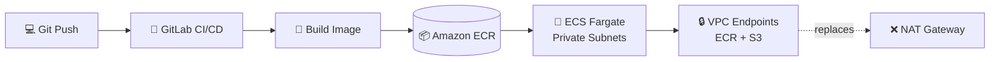

<!-- ============================== BANNER ============================== --> 
  
 
  
 
    
 
     
 
   

---

## 👨‍💻 About Me

DevOps-focused software engineer who builds **AWS infrastructure as code with Terraform** and automates **container deployments to ECS Fargate through GitLab CI/CD**. I secure and monitor workloads with **IAM, AWS WAF and CloudWatch**, and I also build full-stack and mobile products with **Flutter** and **Spring Boot**.

- 🎯 **Focus:** DevOps, Cloud Automation, Infrastructure as Code, CI/CD, Cloud Security
- 💰 **Impact:** cut AWS costs by **40%** by replacing NAT Gateways with VPC endpoints
- 🏅 **Certified:** AWS Cloud Practitioner • AWS AI Practitioner • AWS Serverless
- 🔭 **Currently building:** a **Digital Mandi System** connecting crop buyers and sellers directly
- 🌱 **Currently learning:** advanced AWS architecture, scaling DevOps pipelines, **NLP** and AI model integration
- 🎓 **Teaching Assistant** at FAST-NUCES (Operating Systems, Databases, Discrete Structures)
- 🐧 **Comfortable with:** Linux and Nginx
- 💬 **Ask me about:** Terraform, ECS Fargate, CI/CD, Linux, Nginx, Flutter state management, Spring Boot security, OS fundamentals
- ⚡ **Fun fact:** equally competitive at **badminton** and **chess** ♟️🏸

---

## 🏅 Certifications

  
  
  

  
  
  

| Certification / Course | Issuer | Area |
|---|---|---|
| AWS Certified Cloud Practitioner | AWS | Cloud fundamentals |
| AWS Certified AI Practitioner | AWS | AI / ML on AWS |
| AWS Serverless Demonstrated | AWS | Serverless |
| Hands-On Introduction to Cloud Computing with AWS | Udemy | Cloud |
| Java Spring Boot | Coursera | Backend |
| Flutter and Dart: Developing iOS, Android, and Mobile Apps | Coursera | Mobile |

---

## ☁️ DevOps & Cloud Toolbox

| 🔧 Area | 🛠️ What I Use |
|---|---|
| **Cloud (AWS)** | EC2, S3, RDS, ECS Fargate, IAM, WAF, CloudWatch, VPC, PrivateLink |
| **Infrastructure as Code** | Terraform |
| **CI/CD** | GitLab CI/CD (container builds, rolling zero-downtime updates) |
| **Containers** | Docker, Amazon ECR, ECS Fargate |
| **Linux & Web Servers** | Linux administration, Nginx (web server, reverse proxy) |
| **Security** | IAM least privilege, AWS WAF with JA3 fingerprinting, private subnets |
| **Observability** | CloudWatch Container Insights (CPU, memory, traffic dashboards) |
| **Version control** | Git, GitLab, GitHub |

---

## 🚀 Featured Projects

### 🏗️ Serverless Architecture & Cost Optimization
> **Result: AWS costs reduced by 40%**

- Deployed an **ECS Fargate** backend inside **private subnets** using **Terraform**
- Added **VPC endpoints for ECR and S3**, removing the need for NAT Gateways
- Configured **IAM permissions** to securely connect GitLab CI/CD with AWS
- Built a **GitLab CI/CD pipeline** that automates container builds and rolling updates with **zero downtime**

**Stack:** `Terraform` `ECS Fargate` `ECR` `VPC Endpoints` `IAM` `GitLab CI/CD` `Docker`

### 🛡️ Cloud Observability & Edge Security Framework
- Configured **AWS WAF with JA3 fingerprinting** to catch bot traffic that simple IP-based rules miss, blocking it before it reaches the backend
- Used **CloudWatch Container Insights** to track CPU, memory and traffic in real time from a single dashboard

**Stack:** `AWS WAF` `CloudWatch` `Container Insights` `ECS`

### 🌾 Digital Mandi System *(in progress)*
A platform connecting crop buyers and sellers directly, removing middlemen and bringing transparency to agricultural trade.

**Stack:** `Flutter` `Spring Boot` `MySQL` `AWS`

---

## 💼 Experience

| Role | Where | When |
|---|---|---|
| **Teaching Assistant** | FAST-NUCES, Faisalabad | Aug 2025 – Apr 2026 |
| **Flutter Developer Intern** | IPS Technologies, Lahore | Apr 2025 – Aug 2025 |

- 🎓 Supported **100+ students** across Operating Systems, Database Systems, Discrete Structures and ICT labs; designed practice problems on SQL, process synchronization and networking
- 📱 Built and deployed **REST APIs** for **2 production mobile apps** with real-time sync via Firebase and MongoDB
- 🖼️ Integrated **Cloudinary CDN**, cutting average image load time by **35%**
- 👥 Coordinated a 3-person team using GitLab

**Education:** B.S. Software Engineering, FAST-NUCES

---

## 🧰 Tech Stack

### ⚙️ DevOps & Cloud

### 💻 Languages

### 🎨 Frameworks & UI

### 🗄️ Databases & Tools

---

## 📊 GitHub Stats

  
  

  

---

## 🤝 Let's Connect

  <b>Open to DevOps / Cloud Automation roles and collaboration on open-source Flutter packages or Spring Boot microservices.</b>

  
  
  

  

  

